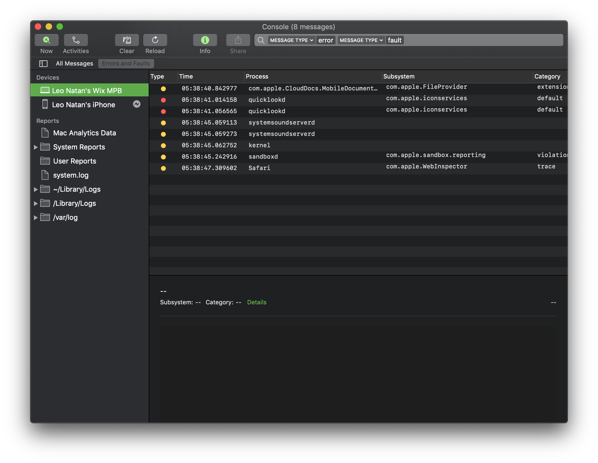
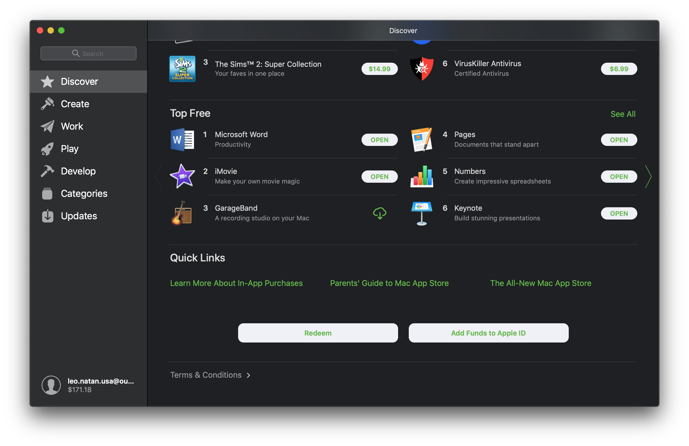

This is a personal repository that fixes some of Apple's dark appearance and accent color bugs that are bothering me, such as in Safari, Console, Mail, App Store, etc.





If you wish to try this, first compile the project. This will create the following dylib:

```/usr/local/lib/libDarkAppearanceOverrides.dylib```

Now run the following command:

```launchctl setenv DYLD_INSERT_LIBRARIES /usr/local/lib/libDarkAppearanceOverrides.dylib```

To uninstall, run the following command:

```launchctl unsetenv DYLD_INSERT_LIBRARIES```

This requires turning off SIP, and some software, such as Safari, is signed with library validation and will not load the dylib. You can resign the offending software to remove that entitlement, or [disable library validation altogether](https://github.com/mologie/macos-disable-library-validation). None of these are advisable, but 🤷‍♂️…